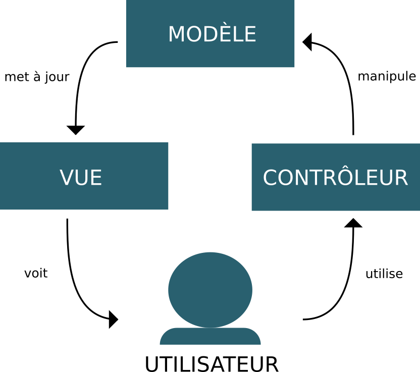

# Tutoriel "Fullstack JavaScript"

Le language Javascript existe depuis 1995. Connu principalement comme le language natif des navigateurs internet, faute d'être le language informatique le plus apprécié, il est devenu indispensable au web. En 20 ans d'existence, le language, et surtout les outils pour l'écrire, a connu beaucoup d'évolutions. Dans ce tutoriel nous allons voir comment il peut être utilisé pour créer une simple application web.

## Conceptes

### Le JavaScript en 2016

Utilisé au départ pour de petites interactions sur les sites internet, le JavaScript permet aujourd'hui de créer de véritables applications. Grâce à l'invention de [NodeJS](https://nodejs.org) en 2009, le language est passé d'une utilisation strictement confinée aux navigateurs à un language qui peut être exectué sur un ordinateur ou un serveur, d'où le "fullstack" dans le titre.

### Fullstack

Dans le jargon, "fullstack" comprends une partie "frontend", liée à une page web et exécutée dans un navigateur et une partie "backend", exécutée côté serveur. Pour le "frontend", nous n'avons pas de choix, seul JavaScript est compris par le navigateur. Pour le "backend" il existe une multitude de languages (PHP, python, java...) mais il y a un avantage certain à utiliser le même language des deux côtés. C'est ce que nous allons faire ici.

### MVC

Le MVC est un [patron de conception](https://fr.wikipedia.org/wiki/Patron_de_conception) ("design pattern" en anglais) qui permet de structurer un programme informatique. Il existe depuis les années 1970 et signifie [Modèle-Vue-Contrôleurs](https://fr.wikipedia.org/wiki/Mod%C3%A8le-vue-contr%C3%B4leur).

Pour faire court, le principe consiste à avoir un Modèle de données indépendant de la présentation (composée de la Vue et des Contrôleurs). Le Modèle met à jour la Vue, ce que voit l'utilisateur. Celui-ci utilise les Contrôleurs pour manipuler le Modèle qui met à jour la vue... et ainsi de suite.



Utilisé du côté serveur depuis des décennies, ce patron de conception est de plus en plus utilisé côté client. Les navigateurs étant devenu de plus en plus performants permettent de déléguer beaucoup de logique jusqu'ici sur le serveur au client.

Pour démontrer ce principe, nous allons créer plusieurs fois une même application avec une liste de choses à faire.

## Table des matières

**Chapitre 1**

### [La mise en page](https://github.com/idris-maps/tutoriel-fullstack-js-1-mise-en-page/blob/master/readme.md)

Dans le premier chapitre nous allons créer une simple page HTML, sans intéractions, pour avoir une mise en page que nous pourrons réutiliser par la suite. Pour certains composants, nous allons utiliser la librairie CSS Bootstrap de Twitter. 

**Chapitre 2**

### [Application en JavaScript pure ou "vanilla"](https://github.com/idris-maps/tutoriel-fullstack-js-2-vanilla-js/blob/master/readme.md)

La première version de l'application, nous allons l'écrire de A à Z. Le but de l'exercice est de comprendre les différentes parties (le modèle, la vue et les contrôleurs) et ce qu'elles font. Il existe beaucoup de librairies, de scriptes créés par d'autres, qui peuvent nous aider à faire une application web. Pour bien comprendre à quoi elles nous servent et en quoi elles nous sont utiles il faut avoir une idée du code qu'elles nous permettent de ne pas écrire. C'est pour cela que nous n'en utilisons pas ici.

**Chapitre 3**

### [Handlebars](https://github.com/idris-maps/tutoriel-fullstack-js-3-handlebars/blob/master/readme.md)

Dans cette deuxième version de notre application. Nous allons utiliser la librairie patron [Handlebars](http://handlebarsjs.com/) pour créer la **vue**. L'application va gagner en lisibilité. 

**Chapitre 4**

### [Riot](https://github.com/idris-maps/tutoriel-fullstack-js-4-riot/blob/master/readme.md)

Dans la troisième version, nous aborderons le développement par **composants**. Nous allons créer des composants réutilisables qui contiennent d'une manière logique le couple **Vue-Contrôleurs**. Le concepte a été popularisé par [React](https://facebook.github.io/react/) de Facebook. Nous allons utiliser la librairie [Riot](http://riotjs.com/).

**Chapitre 5**

### [Angular](https://github.com/idris-maps/tutoriel-fullstack-js-5-angular/blob/master/readme.md)

Dans la quatrième et dernière version de l'application nous allons utiliser le "framework" [Angular](https://angularjs.org/) de Google. Cette fois il ne s'agit plus de remplacer des bouts de codes par des librairies comme dans les deux chapitres précédants mais d'entrer dans une logique de conception en soit. Angular, bien qu'écrit en JavaScript, a une syntaxe, logique et structure particulières. Nous allons voir les pours et les contres d'une telle approche.

**Chapitre 6**

### [Le serveur](https://github.com/idris-maps/tutoriel-fullstack-js-6-serveur/blob/master/readme.md)

Dans ce chapitre nous allons créer un serveur qui fait le lien entre les clients (les applications web) et une base de données. Nous allons utiliser le style d'architecture [REST](https://fr.wikipedia.org/wiki/Representational_State_Transfer) pour la communication entre les clients et la base. Le serveur sera écrit en JavaScript avec [Express](http://expressjs.com/).

**Chapitre 7**

### [AJAX](https://github.com/idris-maps/tutoriel-fullstack-js-7-ajax/blob/master/readme.md)

Dans le dernier chapitre nous allons adapter les clients pour qu'ils communiquent avec le serveur par requêtes [AJAX](https://fr.wikipedia.org/wiki/Ajax_%28informatique%29) une architecture intimement liée aux serveurs REST.

## Pré-requis

Pour suivre ce tutoriel, vous devez connaître un peu de [HTML](https://fr.wikipedia.org/wiki/Hypertext_Markup_Language) et de [CSS](https://fr.wikipedia.org/wiki/Feuilles_de_style_en_cascade) et avoir quelques rudiments de JavaScript. 

Nous allons utiliser [NodeJS](https://nodejs.org/) aussi bien pour créer les scriptes à joindre aux pages HTML que pour écrire le serveur. Si le programme n'est pas encore installé sur votre machine, faites-le maintenant. 

J'utilise Linux mais outre l'installation, ça ne devrait pas avoir d'importance.

### NPM

[NPM](https://www.npmjs.com/) ou gestionnaire de paquets Node sera installé avec Node. Nous allons l'utiliser pour télécharger des scriptes externes et pour construire nos applications.

#### Initialiser NPM

Pour chaque projet nous allons initialiser NPM avec la commande:

```
$ npm init
```

Dans ce tutoriel nous allons beaucoup utiliser le terminal. Les commandes seront précedées par un symbole ```$```, comme dans les systèmes UNIX. Si vous êtes sous Windows, il me semble que le terminal ressemble plutôt à ```c:\>```.

```npm init``` var créer un fichier ```package.json``` à la racine du dossier dans lequel vous l'exécuté. Quelques questions vont vous être posées lors de l'exécution. Vous pouvez donner la réponse par défaut en appuyant sur la touche ```enter```.

#### Télécharger des paquets

Une fois NPM initialisé, vous pouvez télécharger des paquets avec ```npm install```. Pour installer ```riot``` par exemple:

```
$ npm install riot --save
```

```--save``` va faire en sorte que les paquets téléchargés soient ajoutés à ```package.json``` pour garder une trace des dépendances que vous avez utilisé.

#### Utiliser un paquet

Pour utiliser un scripte dans un autre, nous avons la syntaxe suivante:

```
var riot = require('riot')
```

Si nous créons un fichier ```exemple_0.js``` et souhaitons y utiliser ```riot```, écrivez la ligne ci-dessus en haut de page. ```riot``` sera disponible par la variable du même nom.

Vous pouvez aussi utiliser ```require()``` pour référenser des scriptes que vous avez écris de la même manière.

Supposons que nous ayons un fichier ```message.js``` avec:

```
exports.bonjour = function(nom) {
 return 'Bonjour ' + nom + ' !'
}

exports.aurevoir = function(nom) {
 return 'Au revoir ' + nom + ' !'
}
```

Nous pouvons l'utiliser dans un autre fichier ```exemple_1.js``` dans le même dossier ce cette manière:

```
var message = require('./message')

console.log(message.bonjour('Jean-Pierre'))
```

Si vous lancez le fichier dans le terminal:

```
$ node exemple_01
```

Vous aurez:

```
Bonjour Jean-Pierre !
```

#### Installer un paquet globalement

Dans l'exemple ci-dessus nous avons téléchargé ```riot``` pour l'utiliser dans le projet. Nous pouvons aussi installer des paquets **globalement**. C'est à dire que vous pourrez les utiliser dans n'importe quel dossier. Pour ce tutoriel, nous allons utiliser les paquets ```browserify```, ```watchify``` et ```minify```. Nous les installons globalement en ajoutant ```-g``` à la commande.

```
$ npm install browserify watchify minify -g
```

Nous pourrons ainsi les utiliser dans chaque projet.

**browserify**

Cette librairie sert à combiner tous nos fichiers JavaScript en un seul fichier, celui qui sera référencé dans la page HTML. Si nous reprenons le scripte ```exemple_1.js``` où nous avons référencé ```message.js``` nous créons un scripte combiné ```combine.js``` avec cette commande:

```
$ browserify exemple_1.js -o combine.js
```

**watchify**

Watchify fait la même chose que browserify. Sauf qu'une fois la commande lancée, elle surveillera les fichiers référencés pour mettre à jour le scripte final à chaque modification. Elle sera utile pendant que nous travaillons sur une application.

```
$ watchify exemple_1.js -o combine.js
```

**minify**

Comme son nom l'indique minify sert à minifier, c'est à dire rendre aussi petit que possible un scripte.

```
$ minify exemple_1.js -o exemple_1.min.js
```

#### Scriptes NPM

Pour ne pas avoir à réécrire les commandes dans le terminal à chaque fois, vous pouvez les sauvez dans ```package.json```.

Par exemple:

```
{
  "name": "Exemple",
  "version": "1.0.0",
  "description": "",
  "main": "index.js",
  "scripts": {
    "browserify": "browserify main.js -o script.js" // <-- ici
  },
  "author": "idris-maps.com",
  "license": "GPL-2.0"
}
```

Puis lancez la commande avec ```npm run```

```
$ npm run browserify
```

Avec ```|``` vous pouvez créer des commandes qui se lancent l'une après l'autre:

```
{
  "name": "Exemple",
  "version": "1.0.0",
  "description": "",
  "main": "index.js",
  "scripts": {
    "browserify": "browserify main.js -o script.js",
    "minify": "minify script.js -o script.min.js",
    "les-deux": "browserify main.js -o script.js | minify script.js -o script.min.js"
  },
  "author": "idris-maps.com",
  "license": "GPL-2.0"
}
```

En lançant:

```
$ npm run les-deux
```

Browserify va combiner ```main.js``` et ses dépendences en un seul fichier ```script.js```, puis minify va comprimer ```script.js``` pour créer ```script.min.js```.

## Le code

Si vous avez installé NodeJS sur votre ordinateur et installé globalement ```browserify```, ```watchify``` et ```minify```, vous êtes prets à commencer ce tutoriel.

Vous trouverez le code pour chaque exemple sur [github](https://github.com/idris-maps/tutoriel-fullstack-js).


